# Airline Passenger Satisfaction Prediction ✈️

## 🙇‍♂️ Problem description
The project aims to predict airline passenger satisfaction based on various factors such as flight distance, in-flight service, ease of online booking, and departure/arrival time convenience. Understanding the factors that contribute to passenger satisfaction is crucial for airlines to improve their services, enhance customer experience, and increase customer loyalty. By analyzing this dataset, we aim to provide valuable insights into what drives passenger satisfaction and how airlines can better meet customer expectations.

## 🗂️ Dataset
We used this publicly available dataset from kaggle which contains an airline passenger satisfaction survey. 
https://www.kaggle.com/datasets/teejmahal20/airline-passenger-satisfaction

## 🧱 Project pipeline

1. **Data Exploring & Cleaning**:
- Explore the features and the unique values for each.
- Explore dataset size:
o Training data: 103904 rows × 25 columns
o Test data: 25976 rows × 25 columns
- Remove nulls from training & test dataset.
- Check if there are duplicate rows
- Remove unnecessary columns:  ID, Unamed:0

2. **Exploratory Data Analysis**: 
  2.1 Univariate Analysis 
      2.1.1 Charts for categorical variables: 
      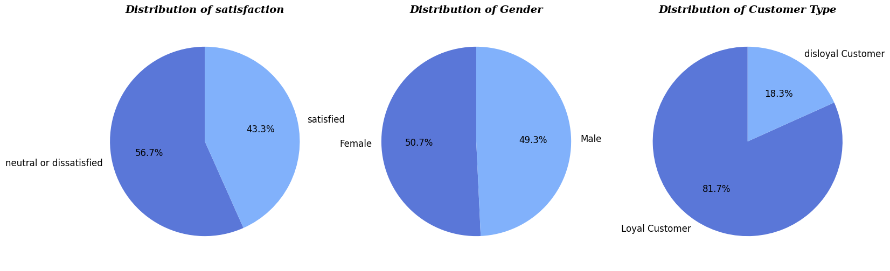
      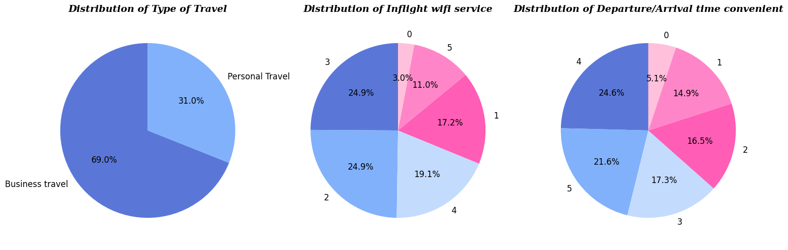
      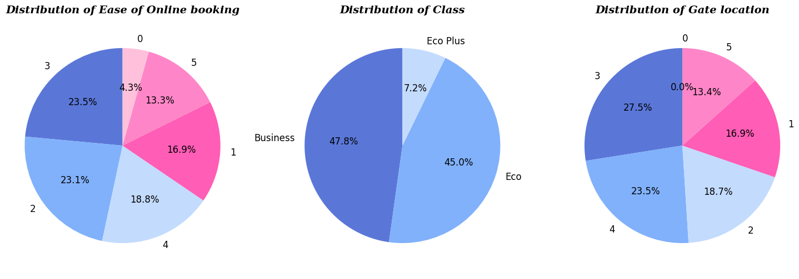
      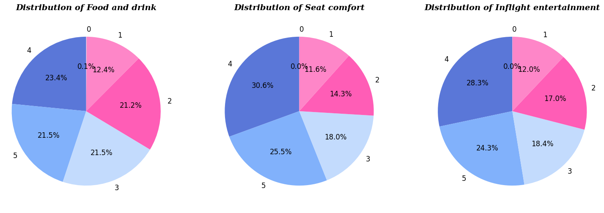
      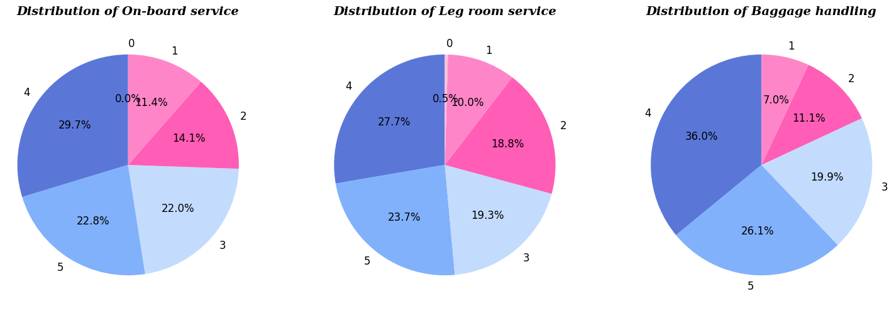
      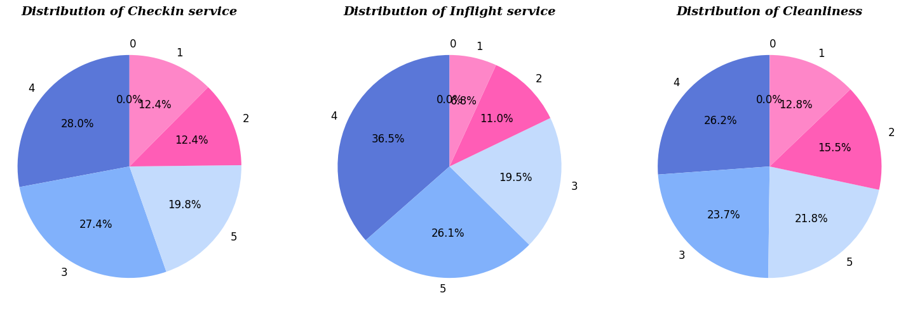
       

      Insights: 
      - There is an almost equal number of male and female participants in the survey. 
      - Most of passengers are neutral or dissatisfied = 56.7% ==> we need to analysis the reasons and try to find business solutions to make them more satisfied 
      - We have more loyal customer data (81.7%)  
      - Most of travels are for Business travel (69%) 
      - Very few people fly in the economy plus class. They usually prefer Economy or Business. 

      2.1.2 Histogram for numerical variables 
       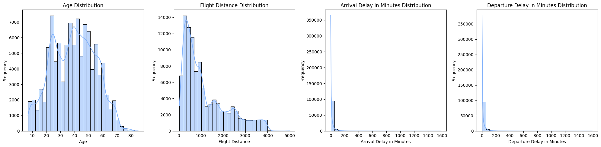 

   Insights:  
   - Most of the delays are 0, which is a good indicator. 
   - The variables Flight Distance and Departure Delay and Arrival Delay are all heavily right-skewed. 

   Investigate problem of outliers: 

      Portion of outliers in each column: 
         Departure Delay in Minutes 0.139831 
         Arrival Delay in Minutes   0.134699 
         Flight Distance            0.022049 

- Since the portion of rows having the outliers in the "Flight Distance" is very small so we will remove it. 
- We will normalize "Departure Delay in Minutes","Arrival Delay in Minutes" 
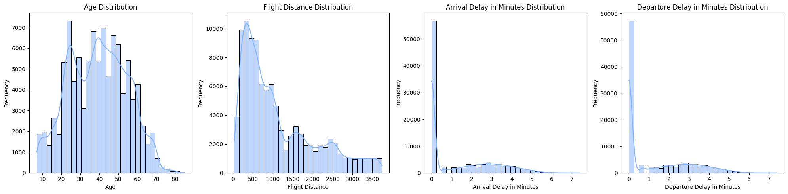 

2.2 Bivariate Analysis 
2.2.1 Bar charts & Pie charts for categorical features 
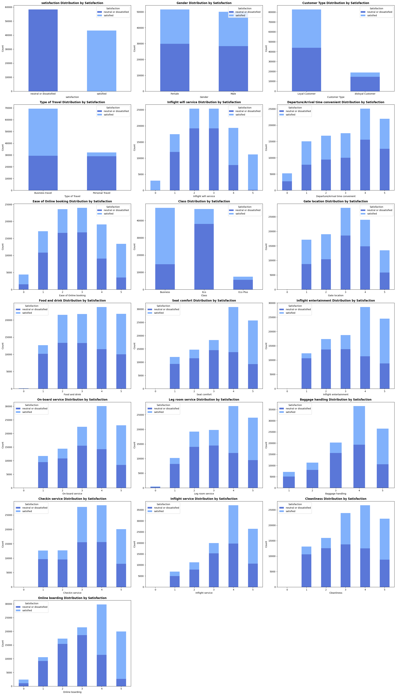 
Then we focused on plotting the distribution for satisfied & dissatisfied for each feature: 
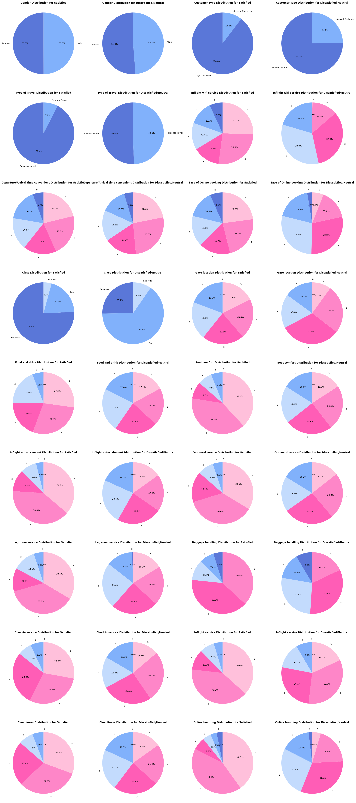 
2.2.2 Histograms for numerical columns
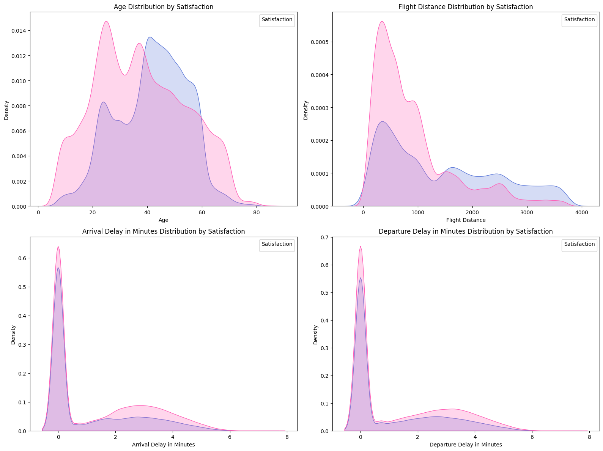 

Grouping to help in insights: 
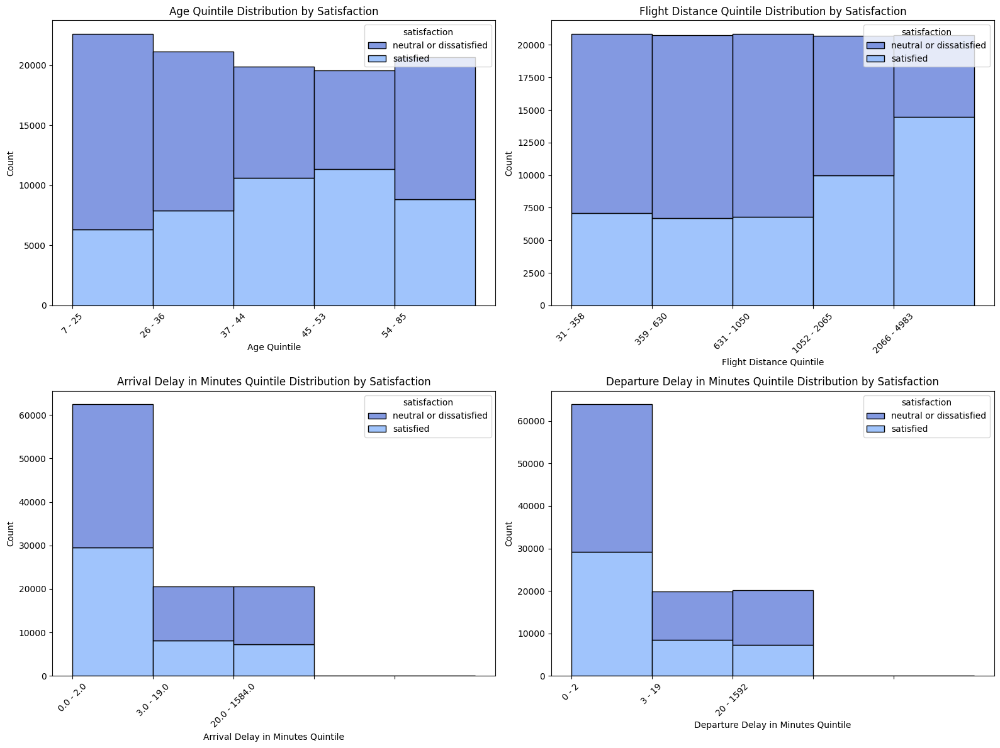 

Insights:  
- Gender nearly doesn't affect satisfaction. 
- Loyal passengers have higher satisfaction percentages than Disloyal ones. 
- Satisfied Passengers usually go for Business travel. 
- Most people of Passengers going for Personal Travel are not satisfied. 
- Satisfied Passengers use Business Class while travelling. 
- Passengers using Eco travelling are the least Satisfied Passengers. 
- More than 80% of passengers flying in economy are either Neutral or Dissatisfied. That shows us that it needs some improvement. 
- Most Satisfied Passengers are in range [37-53] year & Most Unsatisfied are in range [7-36] year. 
- Satisfied Passengers have more long-distance flights than the dissatisfied. 
- The more the delay the less the satisfied passenger's portion. 
- The most frequency in the levels of satisfaction is 4 for all except: [Inflight Wi-Fi service, Ease of Online booking, Gate location] is 3 
- Rate 3 is the most frequent between unsatisfied passengers in services  
- Rate 4 is the most frequent between satisfied passengers in services  
- The ratings are almost evenly distributed between 1 and 5. With that in mind, the positive thing is that there are more positive or neutral ratings (3 through 5) than negative ones (0 through 2). 
- Our passengers have mixed opinions about the Departure and Arrival Time Convenience. We concluded that there is not that much correlation between total Satisfaction and Departure and Arrival Time Convenience. 

2.2.3 Correlation between satisfaction and other columns 
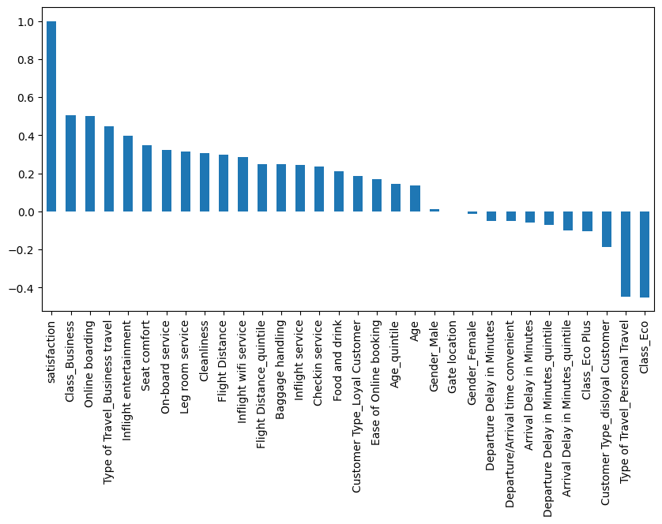 
Insights: 
Positively Correlated: - Business Class ,online boarding, inflight entertainment, seat comfort, on-board service, Legroom service, cleanliness, Flight distance, and Business travels are strong reasons for people satisfaction. 
Negatively Correlated: - Personal Travels, Economy Class, Eco plus Class or being Disloyal Customer results in Unsatisfaction. 

      
      

   
