# Airline Passenger Satisfaction Prediction ✈️

## 🙇‍♂️ Problem description
The project aims to predict airline passenger satisfaction based on various factors such as flight distance, in-flight service, ease of online booking, and departure/arrival time convenience. Understanding the factors that contribute to passenger satisfaction is crucial for airlines to improve their services, enhance customer experience, and increase customer loyalty. By analyzing this dataset, we aim to provide valuable insights into what drives passenger satisfaction and how airlines can better meet customer expectations.

## 🗂️ Dataset
We used this publicly available dataset from kaggle which contains an airline passenger satisfaction survey. 
https://www.kaggle.com/datasets/teejmahal20/airline-passenger-satisfaction

## 🧱 Project pipeline

**1. 🧹 Data Exploring & Cleaning**:
- Explore the features and the unique values for each.
- Explore dataset size:
o Training data: 103904 rows × 25 columns
o Test data: 25976 rows × 25 columns
- Remove nulls from training & test dataset.
- Check if there are duplicate rows
- Remove unnecessary columns:  ID, Unamed:0

**2. 🛰️ Exploratory Data Analysis**: 
  **2.1 Univariate Analysis** 
    2.1.1 Charts for categorical variables: 
      
      
      
      
      
      
      

   **• Insights**:
      
     - There is an almost equal number of male and female participants in the survey.
      
     - Most of passengers are neutral or dissatisfied = 56.7% ==> we need to analysis the reasons and try to find business solutions to make them more satisfied
      
     - We have more loyal customer data (81.7%)
      
     - Most of travels are for Business travel (69%)
      
     - Very few people fly in the economy plus class. They usually prefer Economy or Business. 

 2.1.2 Histogram for numerical variables 
        

   • **Insights**:  
   - Most of the delays are 0, which is a good indicator. 
   - The variables Flight Distance and Departure Delay and Arrival Delay are all heavily right-skewed. 

   Investigate problem of outliers:

      Portion of outliers in each column:
      
       Departure Delay in Minutes: 0.139831
       
       Arrival Delay in Minutes:   0.134699
       
       Flight Distance:            0.022049
         
         
- Since the portion of rows having the outliers in the "Flight Distance" is very small so we will remove it. 
- We will normalize "Departure Delay in Minutes","Arrival Delay in Minutes" 
 

**2.2 Bivariate Analysis** 
2.2.1 Bar charts & Pie charts for categorical features 
 
Then we focused on plotting the distribution for satisfied & dissatisfied for each feature: 
 
2.2.2 Histograms for numerical columns
 

Grouping to help in insights: 
 

• **Insights**:  
- Gender nearly doesn't affect satisfaction. 
- Loyal passengers have higher satisfaction percentages than Disloyal ones. 
- Satisfied Passengers usually go for Business travel. 
- Most people of Passengers going for Personal Travel are not satisfied. 
- Satisfied Passengers use Business Class while travelling. 
- Passengers using Eco travelling are the least Satisfied Passengers. 
- More than 80% of passengers flying in economy are either Neutral or Dissatisfied. That shows us that it needs some improvement. 
- Most Satisfied Passengers are in range [37-53] year & Most Unsatisfied are in range [7-36] year. 
- Satisfied Passengers have more long-distance flights than the dissatisfied. 
- The more the delay the less the satisfied passenger's portion. 
- The most frequency in the levels of satisfaction is 4 for all except: [Inflight Wi-Fi service, Ease of Online booking, Gate location] is 3 
- Rate 3 is the most frequent between unsatisfied passengers in services  
- Rate 4 is the most frequent between satisfied passengers in services  
- The ratings are almost evenly distributed between 1 and 5. With that in mind, the positive thing is that there are more positive or neutral ratings (3 through 5) than negative ones (0 through 2). 
- Our passengers have mixed opinions about the Departure and Arrival Time Convenience. We concluded that there is not that much correlation between total Satisfaction and Departure and Arrival Time Convenience. 

2.2.3 Correlation between satisfaction and other columns 
 
**Insights**: 
Positively Correlated: - Business Class ,online boarding, inflight entertainment, seat comfort, on-board service, Legroom service, cleanliness, Flight distance, and Business travels are strong reasons for people satisfaction. 
Negatively Correlated: - Personal Travels, Economy Class, Eco plus Class or being Disloyal Customer results in Unsatisfaction. 

**2.3 Multivariate Analysis** 
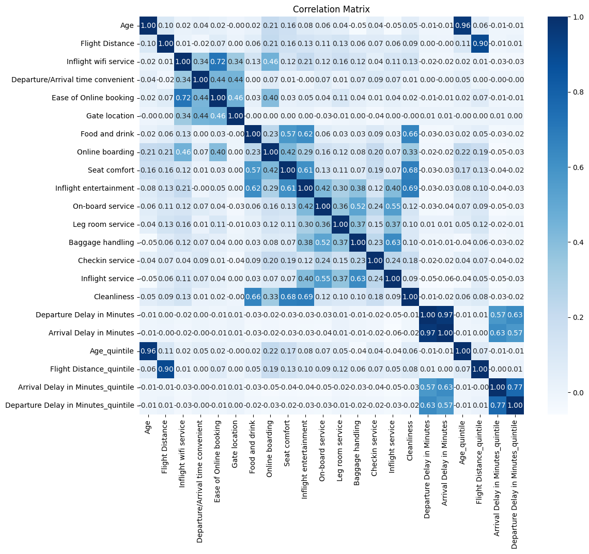 
**Insights**: 
- Departure Delay is highly correlated with Arrival Delay. [Will deal with this in feature engineering]. 
- Inflight WiFi service and Ease of online booking are + correlated. 
- Inflight entertainment, Food and Drink, Seat comfort and cleanliness are + correlated. 
- Baggage handling is + correlated with Inflight service. 

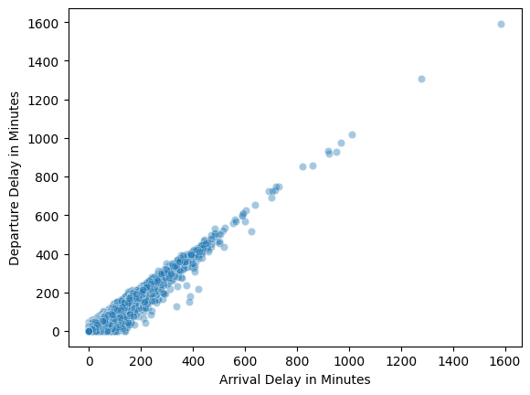 

• **Insights**: 
- There is a strong correlation between the two columns we can drop one of the two columns and as Arrival Delay in Minutes column has some null, we can drop it. 
- Remove quintile columns ['Age_quintile', 'Flight Distance_quintile', 'Arrival Delay in Minutes_quintile', 'Departure Delay in Minutes_quintile'] 

**2.4 Clustring:** 
Applying Kmeans on the data with 3 clusters 
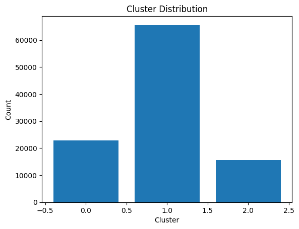 
The portion of each class: 
<ol>
 <li>Class 1 ==> 0.630900</li>
 <li>Class 0 ==> 0.219453</li>
 <li>Class 2 ==> 0.149648</li>
</ol>

• Most of the data (63%) is in one cluster (cluster 1)  
• Showing aggregates of each numeric column grouped by the cluster. 

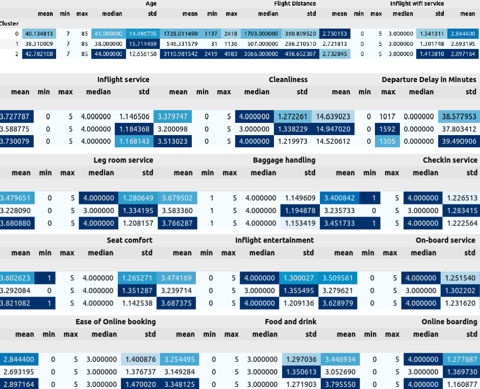 

• **Insights**: 
− All age values are in the 3 clusters [7-85] 
− Flight Distances is distributed on all clusters without intersection between them: 
− Cluster 1 contains flight distance in the range [1137:2418] 
− Cluster 0 contains flight distance in the range [31:1136] 
− Cluster 2 contains flight distance in the range [2419:4983] 
− Value 0 for seat comfort column is only in cluster 1 
− Value 0 for Checkin service column is only in cluster 1 
− Values in range [1017:1592] don't exist in class 0 
− Values in range [1305:1592] don't exist in class 2 

Show the cluster distribution over the categories of categorical features: 
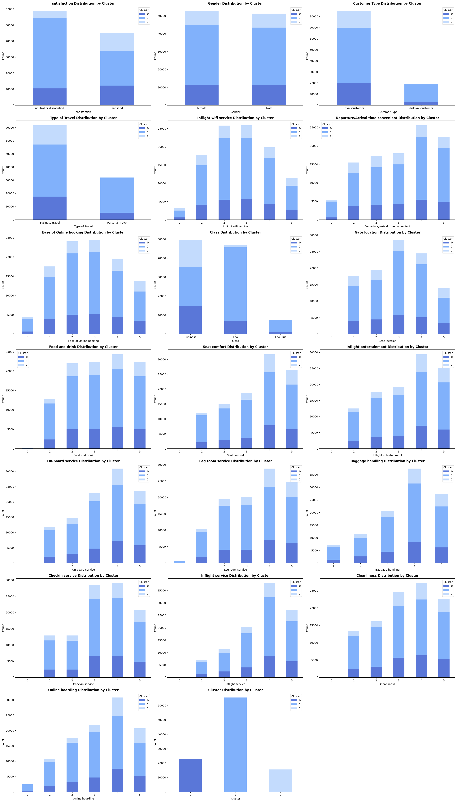 

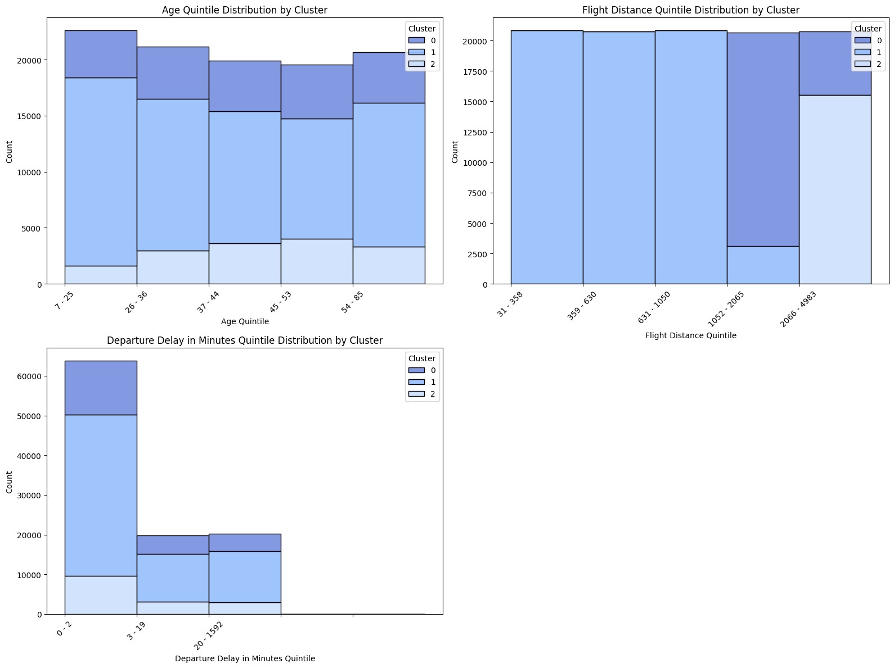 

• **Insights**: 
- Cluster 1 is the major class in all values in all columns. 
- Satisfied customers are distributed over all cluster. 
- Dissatisfied or neutral customers are distributed over all cluster. 
- Each gender is distributed over all clusters. 
- Loyal customer is distributed over all clusters. 
- Cluster 2 doesn't contain Disloyal customers. 
- The portion of customers with type of travel is personal in cluster 2 is very small. 
- All values of [Inflight WiFi service, departure arrival time convenient, Ease of online booking, Gate Location, Food and drink, 
- seat comfort, inflight entertainment, on-board service, Baggage handling, Checkin service, inflight service & cleanliness] are distributed over all clusters. 
- The portion of departure arrival time convenient with value 0 in cluster 2 is very small. 
- Cluster 2 doesn't contain customers of Eco plus class. 
- The portion of of customers of Eco class in cluster 2 is very small. 
- Cluster 2 doesn't contain values 0 of Online boarding. 
- Values 0 of Leg room service are all in cluster 1. 

**2.5 Association Rules**  
Applying Apriori algorithm with minimum support = 0.25 and minimum cardinality = 2  

•Top 10 rules sorted by support:  
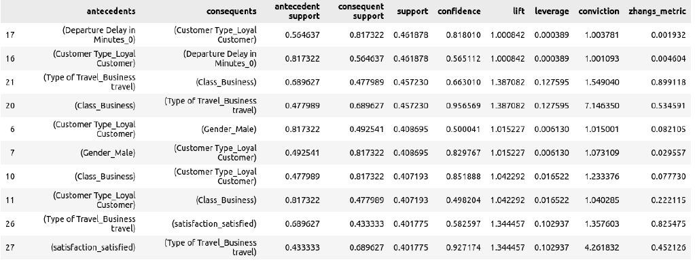 

•Top 10 rules sorted by confidence:  
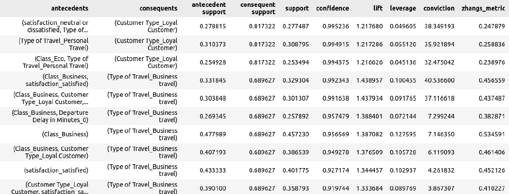 

•Top 10 rules sorted by lift:  
 

• Most frequent 2-itemset: {'Type of Travel_Business travel', 'Customer Type_Loyal Customer'} 
    o Frequency: 0.5085 
• Top 5 frequent items:  
  

Associaton Rules Analysis   
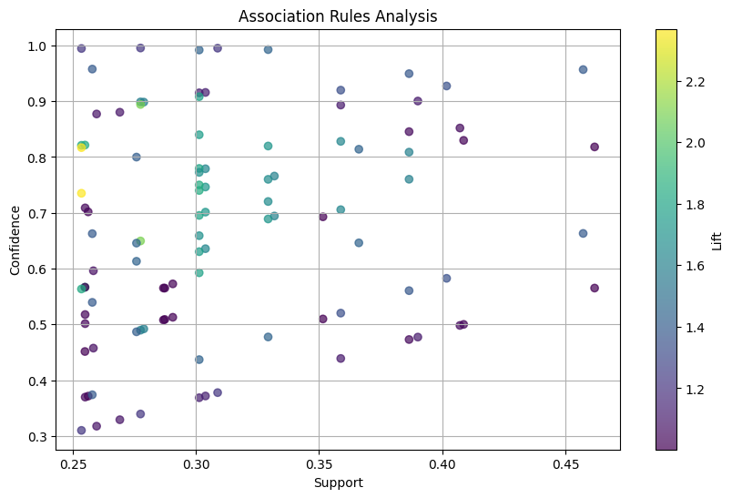  

•Top 10 rules sorted by lift:  
 
- The most interesting rules that are likely to provide real business value and insights are those with high lift values. 
- Lift measures how much more likely the consequent (rhs) is, given the antecedent (lhs), compared to if the two were independent.  

• **Insights**: 
o If a customer's type of travel is "Personal Travel", then there is a strong association with the customer being classified as "Eco" class and a "Loyal Customer". 
o The lift value of 2.3681 indicates that the occurrence of the antecedent and consequent together is 2.3681 times more likely than if they were statistically independent. 
o This means that customers who travel for personal reasons are 2.3681 times more likely to be classified as "Eco" class and "Loyal Customers" compared to what would be expected if these attributes were unrelated. 
o The confidence value of 0.8167 indicates that 81.67% of the transactions that contain "Personal Travel" also contain "Eco" class and "Loyal Customer". 
o The support value of 0.2535 indicates that 25.35% of the transactions contain both "Personal Travel" and "Eco" class and "Loyal Customer". 
o If a customer is classified as "Eco" class and is a "Loyal Customer", then there is a strong association with their type of travel being "Personal Travel". 
o The lift value of 2.3681 indicates that the occurrence of the consequent given the antecedent is 2.3681 times more likely than if they were statistically independent. 
o This means that customers who are classified as "Eco" class and "Loyal Customers" are 2.3681 times more likely to travel for personal reasons compared to what would be expected if these attributes were unrelated. 
o The confidence value of 0.7350 indicates that 73.50% of the transactions that contain "Eco" class and "Loyal Customer" also contain "Personal Travel". 
o The support value of 0.2535 indicates that 25.35% of the transactions contain both "Eco" class and "Loyal Customer", and "Personal Travel". 
o If a customer is classified as a "Loyal Customer" and their satisfaction level is "neutral or dissatisfied", then there is a strong association with their type of travel being "Personal Travel". 
o The lift value of 2.0927 indicates that the occurrence of the consequent given the antecedent is 2.0927 times more likely than if they were statistically independent. 
o This means that if a customer is classified as a "Loyal Customer" and their satisfaction level is "neutral or dissatisfied", there is 2.0927 times more likely that their type of travel will be "Personal Travel" compared to what would be expected if these attributes were unrelated. 
o The confidence value of 0.6495 indicates that 64.95% of the transactions that contain "Loyal Customer" with a satisfaction level of "neutral or dissatisfied" also contain "Personal Travel". 
o The support value of 0.2775 indicates that 27.75% of the transactions contain both "Loyal Customer" with a satisfaction level of "neutral or dissatisfied", and "Personal Travel". 
o If a customer's type of travel is "Personal Travel", then there is a strong association with the customer being classified as a "Loyal Customer" and having a satisfaction level of "neutral or dissatisfied". 
o The lift value of 2.0927 indicates that the occurrence of the consequent given the antecedent is 2.0927 times more likely than if they were statistically independent. 
o This means that if a customer's type of travel is "Personal Travel", there is a higher likelihood that the customer will be classified as a "Loyal Customer" and have a satisfaction level of "neutral or dissatisfied" compared to what would be expected if these attributes were unrelated. 
o The confidence value of 0.8940 indicates that 89.40% of the transactions that contain "Personal Travel" also contain "Loyal Customer" with a satisfaction level of "neutral or dissatisfied". 
o The support value of 0.2775 indicates that 27.75% of the transactions contain both "Personal Travel" and "Loyal Customer" with a satisfaction level of "neutral or dissatisfied". 
o If a customer's type of travel is "Business travel" and their satisfaction level is "satisfied", then there is a moderate association with the customer being classified as "Business" class and a "Loyal Customer". 
o The lift value of 1.8417 indicates that the occurrence of the consequent given the antecedent is 1.8417 times more likely than if they were statistically independent. 
o The confidence value of 0.7499 indicates that 74.99% of the transactions that contain "Business travel" with a satisfaction level of "satisfied" also contain "Business" class and "Loyal Customer". 
o The support value of 0.3013 indicates that 30.13% of the transactions contain both "Business travel" with a satisfaction level of "satisfied", and "Business" class and "Loyal Customer". 
o If a customer is classified as "Business" class and is a "Loyal Customer", then there is a moderate association with their type of travel being "Business travel" and their satisfaction level being "satisfied". 
o The lift value of 1.8417 indicates that the occurrence of the consequent given the antecedent is 1.8417 times more likely than if they were statistically independent. 
o The confidence value of 0.7400 indicates that 74.00% of the transactions that contain "Business" class and "Loyal Customer" also contain "Business travel" with a satisfaction level of "satisfied". 
o The support value of 0.3013 indicates that 30.13% of the transactions contain both "Business" class and "Loyal Customer", and "Business travel" with a satisfaction level of "satisfied". 
o If a customer is classified as "Eco" class, then there is a moderate association with their type of travel being "Personal Travel". 
o The lift value of 1.8257 indicates that the occurrence of the consequent given the antecedent is 1.8257 times more likely than if they were statistically independent. 
o The confidence value of 0.5666 indicates that 56.66% of the transactions that contain "Eco" class also contain "Personal Travel". 
o The support value of 0.2549 indicates that 25.49% of the transactions contain both "Eco" class and "Personal Travel". 
o If a customer's type of travel is "Personal Travel", then there is a strong association with the customer being classified as "Eco" class. 
o The lift value of 1.8257 indicates that the occurrence of the consequent given the antecedent is 1.8257 times more likely than if they were statistically independent. 
o The confidence value of 0.8214 indicates that 82.14% of the transactions that contain "Personal Travel" also contain "Eco" class. 
o The support value of 0.2549 indicates that 25.49% of the transactions contain both "Personal Travel" and "Eco" class. 
o If a customer is classified as a "Loyal Customer" and their type of travel is "Personal Travel", then there is a strong association with the customer being classified as "Eco" class. 
o The lift value of 1.8247 indicates that the occurrence of the consequent given the antecedent is 1.8247 times more likely than if they were statistically independent. 
o The confidence value of 0.8209 indicates that 82.09% of the transactions that contain both "Loyal Customer" and "Personal Travel" also contain "Eco" class. 
o The support value of 0.2535 indicates that 25.35% of the transactions contain both "Loyal Customer" and "Personal Travel", and "Eco" class. 
o If a customer is classified as "Eco" class, then there is a moderate association with the customer being classified as a "Loyal Customer" and their type of travel being "Personal Travel". 
o The lift value of 1.8247 indicates that the occurrence of the consequent given the antecedent is 1.8247 times more likely than if they were statistically independent. 
o The confidence value of 0.5635 indicates that 56.35% of the transactions that contain "Eco" class also contain both "Loyal Customer" and "Personal Travel". 
o The support value of 0.2535 indicates that 25.35% of the transactions contain "Eco" class, "Loyal Customer", and "Personal Travel". 

**3. 🔧 Preprocessing**

1- Encode categorical variables. 2- Drop Arrival delay in minutes column. 
2- Drop unnecessary columns (columns that don’t affect satisfaction)['Gender','Gate location','Departure/Arrival time convenient'] 
3- Apply grouping on features with continuous variables 
4- Standardization: scaling features by subtracting the mean and then dividing by the standard deviation. 
   This results in features that have a mean of 0 and a standard deviation of 1. 

**4. 🔩 Model Building, Results and Evaluation:**     
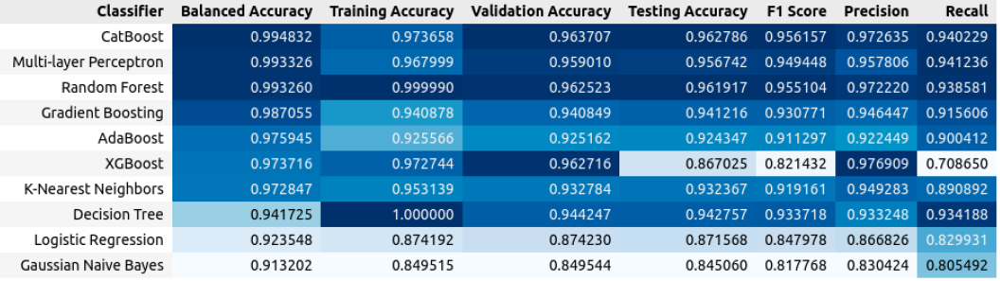 

• CatBoost achieved the highest F1 Score & Balanced Accuracy   
• Multi Nominal Naive Bayes without applying grouping on features with continuous variables from sklearn: 
o Balanced Accuracy: 0.8741036230929793 
o Training Accuracy: 0.7680455035417308 
o Testing Accuracy: 0.7649034093153716 
o Validation Accuracy: 0.7680455332217699 
o F1 Score: 0.7330791657322269 
o Precision: 0.7187335092348285 
o Recall: 0.7480091533180778  
• Multi Nominal Naive Bayes with applying grouping on features with continuous variables from sklearn: 
o Balanced Accuracy: 0.8660401815904305 
o Training Accuracy: 0.7687865722205113 
o Testing Accuracy: 0.7656145063801209 
o Validation Accuracy: 0.7687288538824919 
o F1 Score: 0.7336236699142458 
o Precision: 0.7199506520972858 
o Recall: 0.7478260869565218  
• Multi Nominal Naive Bayes without applying grouping on features with continuous variables from scratch using map reduce: 
o Balanced Accuracy: 0.7650422898817919 
o Training Accuracy: 0.8885220973206036 
o Testing Accuracy: 0.7626516019436653 
o f1_score: 0.7399809573271012 
o precision: 0.7018307199737296 
o recall: 0.7825171624713959  
• Multi Nominal Naive Bayes with applying grouping on features with continuous variables from scratch using map reduce: 
o Balanced Accuracy: 0.7611859775085901 
o Training Accuracy: 0.9015629812134278 
o Testing Accuracy: 0.7623750641962628 
o f1_score: 0.7321547846996482 
o precision: 0.7128858827610128 
o recall: 0.7524942791762014 

## azure: 

 
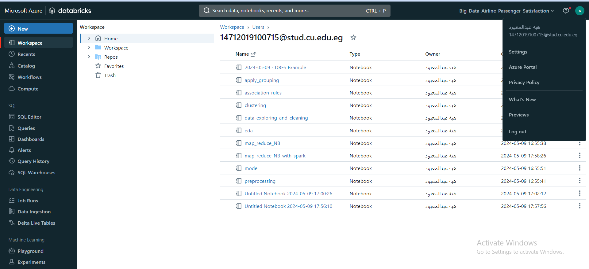 
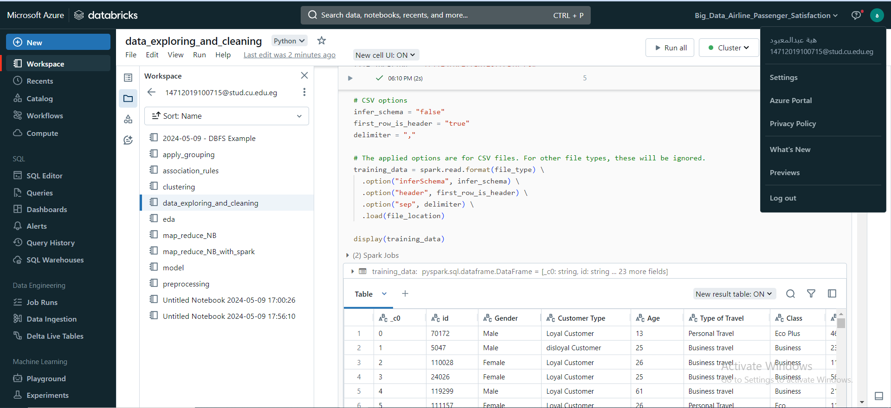 

      
      

   
